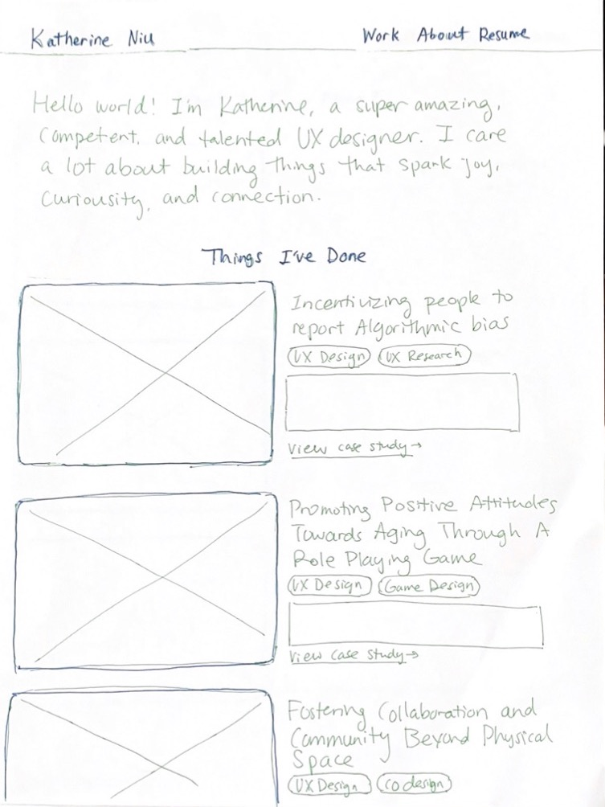
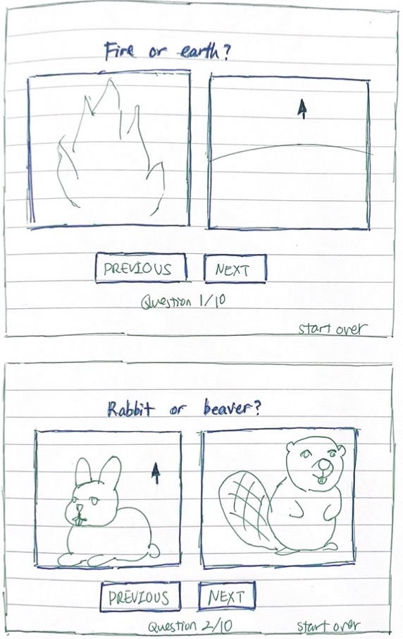

<mark>**Note that this document order from FP4 -> FP1**</mark>

<mark>Please sign up for the study</mark> at [https://tinyurl.com/pui-study](https://tinyurl.com/pui-study) to allow us to use your submission to create a better GenAI assistant for designers!

---

# **FP4 \- Final Project Writeup**

Feel free to refer to this [Markdown Cheat Sheet](https://www.markdownguide.org/cheat-sheet/) to make your writeup more organized, and you can preview your markdown file in VSCode [Markdown editing with Visual Studio Code](https://code.visualstudio.com/docs/languages/markdown#_markdown-preview). 

## Part 1: Website Description

Describe your website (300 words).

* What is the purpose of your website?   
* Who is the target audience?  
* What information do you convey with your website?   
* How is it interesting and engaging? 

## Part 2: User Interaction

How a user would interact with your website? For each step, briefly but clearly state the interaction type & how we should reproduce it.

1. Interaction type. Click on X on page Y / scroll on page X, etc.  
2. 

## Part 3: External Tool

Describe what important external tool you used (JavaScript library, Web API, animations, or other). Following the bulleted list format below, reply to each of the prompts.

1. Name of tool1  
   * Why did you choose to use it over other alternatives? (2 sentences max)  
   * How you used it? (2 sentences max)  
   * What does it add to your website? (2 sentences max)  
2. Name of tool2

## Part 4: Design Iteration

Describe how you iterated on your prototypes, if at all, including any changes you made to your original design while you were implementing your website and the rationale for the changes. (4-8 sentences max)

## Part 5: Implementation Challenge

What challenges did you experience in implementing your website? (2-4 sentences max)

## Part 6: Generative AI Use and Reflection

Describe how you used Generative AI tools to create this final project (fill in the following information, write \~500 words in total).

Document your use of all GenAI tools — ChatGPT, Copilot, Claude, Cursor, etc. using the template below. Add/Delete rows or bullet points if needed, and replace Tool1/Tool2 with the name of the tool.

### Usage Experiences by Project Aspects

Feel free to edit the column \_ (other?) or add more columns if there's any other aspect in your project you've used the GenAI tools for.

For the following aspects of your project, edit the corresponding table cell to answer:
- *Usage*: Whether you used / did not use this tool for the aspect. Enter [Yes/No]
- *Productivity*: Give a rating on whether this tool makes your productivity for X aspect [1-Much Reduced, 2-Reduced, 3-Slightly Reduced, 4-Not Reduced nor Improved, 5-Slightly Improved, 6-Improved, 7-Much Improved].

| Tool Name | Ratings | design | plan | write code | debug | \_ (other?) |
| :---- | :---- | :---- | :---- | :---- | :---- | :---- |
| Tool1 | Usage | Yes/No | Yes/No | Yes/No | Yes/No | Yes/No |
| Tool1 | Productivity | 1~7 | 1~7 | 1~7 | 1~7 | 1~7 |
| Tool2| Usage | Yes/No | Yes/No | Yes/No | Yes/No | Yes/No |
| Tool2 | Productivity | 1~7 | 1~7 | 1~7 | 1~7 | 1~7 |

### Usage Reflection

> Impact on your design and plan 
* It matched my expectations and plan in [FP2](#generative-ai-use-plan) in that … For example, 
  1. Tool1: 
  2. Tool2:
* It did not match my expectations and plan in [FP2](#generative-ai-use-plan) in that … For example, 
  1. Tool1: 
  2. Tool2:
* GenAI tool did/did not influence my final design and implementation plan because … For example, 
  1. Tool1: 
  2. Tool2:

> Use patterns
* I accepted the generations when …  For example, 
  1. Tool1: this tool once suggested … and I adjusted my design according to the suggestion because … 
  2. Tool2: 
* I critiqued/evaluated the generated suggestions by … For example, 
  1. Tool1: this tool once suggested … but I modified/rejected the suggestion because … 
  2. Tool2: 

> Pros and cons of using GenAI tools
* Pros
  1. Tool1: 
  2. Tool2:
* Cons
  1. Tool1: 
  2. Tool2:

### Usage Log

Document the usage logs (prompts and chat history links) for the GenAI tools you used. Some tools may not have an easy way to share usage logs, just try your best! Some instructions for different tools:

1. [ChatGPT](https://help.openai.com/en/articles/7925741-chatgpt-shared-links-faq) / [Gemini](https://support.google.com/gemini/answer/13743730?hl=en&co=GENIE.Platform%3DDesktop): share the anonymous link to all of your chat histories relevant to this project
2. [GitHub Copilot (VSCode)](https://code.visualstudio.com/docs/copilot/copilot-chat#:~:text=You%20can%20export%20all%20prompts%20and%20responses%20for%20a%20chat%20session%20in%20a%20JSON%20file%20with%20the%20Chat%3A%20Export%20Session...%20command%20(workbench.action.chat.export)%20in%20the%20Command%20Palette.): export chat histories relevant to this project.

---

# **FP3 \- Final Project Check-in**

Document the changes and progress of your project. How have you followed or changed your implementation & GenAI use plan and why? Remember to commit your code to save your progress.

## Implementation Plan Updates

- [ ] ...

## Generative AI Use Plan Updates

- [ ] ...

Remember to keep track of your prompts and usage for [FP4 writeup](#part-6-generative-ai-use-and-reflection).

---

# **FP2 \- Evaluation of the Final project**

## Project Description

Briefly restate your motivation and a short description of your project.

## High-Fi Prototypes

### *Prototype 1*

A brief description and summary of the user feedback (\<100 words, 2 images) 

### *Prototype 2*

…

## Usability Test

Discuss the user feedback you got during the evaluation / usability test (\~300 words). Indicate which feedback you implemented, inspired new directions, or otherwise influenced your final design. 

## Updated Designs

Show screenshots of your updated design based on the user feedback (\<100 words, \~2 images).

## Feedback Summary

Summarize the feedback you received in the lab session and discuss how it influenced your design (\~300 words). 

## Milestones

Outline weekly milestones to plan your expected implementation progress until the end of the semester (\~300 words). 

### *Implementation Plan*

- [ ] Week 9 Oct 28 \- Nov 1:
  - [X] FP1 due
  - [ ] ...
  
- [ ] Week 10 Nov 4 \- Nov 8:   
  - [ ] FP2 due

- [ ] Week 11 Nov 11 \- Nov 15:  
- [ ] Week 12 Nov 18 \- Nov 22:   
- [ ] Week 13 Nov 25 \- Nov 29:  

  - [ ] Thanksgiving  
- [ ] Week 14 Dec 2 \- Dec 6:  
  - [ ] FP4 due 

### *Libraries and Other Components*

List the JS libraries and other components (if applicable) that you plan to use. 
* 

## Generative AI Use Plan

Outline how you plan to use Generative AI tools to aid in the implementation (\~300 words).

### *Tool Use*

 What would you use? Edit the list given your plan. For each tool, explain briefly on what do you expect Generative AI to help you with and what might it not be able to help you with.

* ChatGPT  
  * I will use it for … because it can help me …  
  * I will not use it for … because it might not be able to help me with …   
* GitHub Copilot  
* ...

### *Responsible Use*

How would you use Generative AI responsibly? 

---

# **FP1 \- Proposal for Critique**

## Idea Sketches

### *Idea 1* Portfolio

* What is the basic idea of your final project?

The goal is to create a portfolio website which showcases my design work to potential employers and industry professionals. Every page will have the navigation at the the top and contact info at the bottom. The main page will have a work section which contains an overview of 4 case studies and a brief (1-2 sentence) introduction. Each card under the work section will link to a case study for that project. The about page will contain a short bio and some interesting info.

* How do you plan to make your design interactive and engaging?  

I will create a sidebar menu on each case study page to enable users to jump to specific sections, create slideshows for users to browse through images, embed Figma prototypes, and use scroll effects to showcase different content as the user scrolls. I will use playful visual design and UX writing to show more personality. 

* How do you plan to make your design accessible?  

I plan to make my design accessible by using well-structured HTML, alt text for all images, large-enough targets, and good contrast between text and background. To reduce cognitive load, I will add descriptions under each image so that people know what it conveys and I will add use headings, bullet points, cards, and bolded text to draw attention to important things and make the content more digestible. 

* What information do you specifically want to convey and include on your website?

Under each card under the work section, I want to include a visually compelling mockup, a descriptive title that conveys why that project matters, labels that highlight the domain (e.g. UX Design, UX Research, Game Design, etc.), and button that says "View Project." 
The navigation will contain links to the work section, about page, and resume.

### *Idea 2* Perfume Recommendation Quiz

* What is the basic idea of your final project?

The goal is to create a fun quiz to help people discover new perfumes. The quiz will contain a series of questions that are meant to be playful and evocative. Questions can be a combination of single-select, multiple-select, sliders, and drag and drop. Based on the user's answers, the website will generate a recommended fragrance. For the recommended fragrance, there will be a list of notes and an explanation for why that fragrance was chosen. The user can also see all of their answers to the quiz questions and change their answers to generate a different recommended fragrance. 

Users have the option of viewing their recommended fragrance on a "fragrance wall". This will be another page in the website which maps out all of the fragrances in the data set according to the fragrance wheel or fragrance categories. Users can browse the fragrance wall by dragging the screen with their mouse. Clicking on a specific fragrance will open up information about the fragrance. 

The data set can be a set of fragrances from a single fragrance brand, a set of fragrances by a single perfumer, or some internet list of "top 50 perfumes of the 2020s". Information about fragrances are publicly available on the fragrance database Fragrantica. 

* How do you plan to make your design interactive and engaging?

I will incorporate different interaction patterns for the quiz questions such as single-select, multiple-select, sliders, and drag and drop. I will use creative UI elements, playful copywriting, and animated effects (if it's technically feasible) to create a visually appealing interactive experience. 

* How do you plan to make your design accessible?  

I plan to make my design accessible by using well-structured HTML, alt text for all images, large-enough targets, and good contrast between text and background. 

* What information do you specifically want to convey and include on your website?

I want to convey information about specific fragrances (their notes, fragrance category, accords, perfumer, description) and how the fragrance relates to the answers that users chose in the quiz. 
…

### *Idea 3* Mapping Food Insecurity in Pittsburgh

* What is the basic idea of your final project?

The goal is to create a data visualization website which maps where food insecurity exists in Pittsburgh geographically and shows the relationship between food insecurity, health outcomes, and demographics such as race and income. 

* How do you plan to make your design interactive and engaging?

As the user scrolls, different information and visualizations will be shown. The user might start by seeing a map which represents the food insecurity level of each census tract with colors (darker colors means more food insecure). As the user scrolls, the website will zoom in on a food insecure neighborhood such as the Hill District and they might see a another visualization which shows how long it takes for the average person in the Hill District to get to the nearest grocery store, another visualization which shows the average prices for specific items at the local stores (which are probably more expensive), and what kinds of food are available (probably mostly processed food). The stats for the Hill District will be compared to the stats for a food-secure neighborhood such as Shadyside to show the disparity. 

* How do you plan to make your design accessible?  

I plan to make my design accessible by using well-structured HTML, alt text for all images, large-enough targets, and good contrast between text and background. To reduce cognitive load, I will add descriptions under each image so that people know what it conveys. I will showcase small amounts of information at a time and use simple language to reduce cognitive load. 

* What information do you specifically want to convey and include on your website?

How long it takes for the average person in a food insecure neighborhood to get to a grocery store, the cost and availablity of healthy food in their local stores, and obesity level compared to a food-secure neighborhood. 
…

## Feedback Summary
Perfume Recommendation Quiz: Marshall suggested that I focus on defining clear user needs and user stories. For the result page, he suggested adding explanations that connect quiz answers to the perfume recommendation. I need to decide if the quiz questions will be single or multi-select and I need to consider how users will review and change answers to get a different recommendation. He recommended using a sample of real data to guide question design and limit the scope of the project. Classmates gravitated towards this idea because they found it to be fun and playful. 

Mapping Food Insecurity in Pittsburgh: Marshall thought this project is impactful and could benefit from a list of data inquiries that users would explore. He recommended finding similar projects online to get design inspiration and adopt useful features and address limitations. He also recommended on limiting the scope and focusing on essential usability-driven features to demonstrate my skills without being too ambitious. 

Design Portfolio: Marshall encouraged me to pursue creative ideas. The challenge this project would be to make myself stand out among the crowd of design portfolios. 

A key takeaway is being strategic about the scope of the project. 

## Feedback Digestion

Digest the feedback you got in the lab (\~300 words). Indicate which critique you will act on in your next design and why you chose to incorporate/dismiss pieces of critique.

I want to expand on my second idea which is the perfume recommendation quiz. Before I create a prototype, I will first write out a list of potential user stories and prioritize the most important ones. One user story could be "As a user, I want to be able to go back to a previous question so that I have the freedom to change my answer." I will have to decide on what data set to use, the style of questions (provocative vs. realistic), the user selection UI patterns(single select, multi-selecdt, slider, etc.), and how the answers will determine the final outcome. I also need to ensure that the user can navigate back and forth between questions during the quiz to change their answers, start over, know their progress, and change their answers after they complete the quiz to change the recommendation. I think all of the critique is valuable and there's nothing that I want to dismiss. 